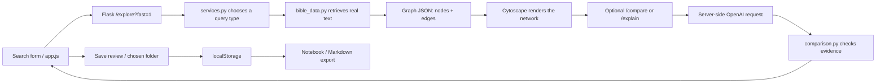

# Scripture Graph code walkthrough

AI-generated learning notes. Reading these notes is not evidence that the student independently wrote the implementation. Use them to inspect the actual source and practice explaining it without notes.

## Start with the request flow

The browser and server are different programs. JavaScript sends HTTP requests; Flask responds with JSON. A graph node describes a passage, person, topic, or category. An edge describes a relationship between two node IDs. Cytoscape draws that data; it does not decide theology or fetch Scripture itself.

## Frontend: read these functions in order

### `app.js`: configuration and notebook loading

The beginning selects the API base URL and creates state variables. `cy` is the Cytoscape instance; `currentData` holds the latest retrieved graph; `selectedPassage` is the item available to save. `requestNumber` identifies the current search. `pendingSave` snapshots the item shown in a save review.

The notebook uses the key `scripture-graph-notebook-v1` in browser `localStorage`. Its `collections` array holds folders with IDs, names, passages, and optional outlines. `trash` holds recoverable deleted folders. `activeCollectionId` remembers the selected folder. The validation at startup prevents malformed stored data from crashing the UI. The key stays the same so previous studies remain readable.

### `fetchGraph()` and `runSearch()`

`fetchGraph()` checks the browser cache, calls the backend, parses JSON, and validates graph shape. It returns a copy of cached data so later changes do not mutate the saved result.

`runSearch()` trims and validates input, aborts earlier work, and increments the request number. With two searches, `Promise.all` starts them together. It merges the results, builds the graph, fills the panels, and starts optional interpretation. Responses check their request number before updating the UI. This matters when an older, slower search finishes after a new one.

### `renderGraph()` and selection

`renderGraph()` sets Cytoscape styles and event handlers. Blue/purple distinguish the search sides. Yellow dashed edges have type `theme-bridge`. Clicking a node calls `showNodeDetails()`; clicking a thematic edge calls `showThematicConnection()`.

`showThematicConnection()` explains the shared idea first, then each selected passage's contribution, with the verse readings collapsed. Sidebar connection buttons use the same function, so their behavior matches clicking a yellow line. Thematic counts come from actual graph edges, not exact-reference overlap.

### `renderNotebook()` and persistence

`renderNotebook()` turns the selected folder into collapsible passage cards. Its search only filters what is displayed. `persistNotebook()` saves the whole notebook, while `updateNotebookCounts()` refreshes folder counts without replacing the note textarea being edited.

Typing into a note updates that entry's `note`, then saves storage. There is no database or user account. Notes are local to this browser/device. Closing a notebook does not delete notes; clearing browser data does.

### Saving and deleting

`reviewSave()` copies the selected verse or comparison into `pendingSave`. The save-review form names the item and destination. Nothing is saved until its submit event runs. It can create a folder or use an existing one.

When saving, missing passages are added; duplicate IDs are left alone so existing notes survive. A saved comparison replaces that folder's one outline after the review explicitly says so. The saved folder opens afterward.

Delete folder moves the entire folder object into `trash`. If the last active folder is deleted, an empty folder is created so selection remains valid. `restoreFolder()` moves it back, preserving notes/outlines and resolving possible name or ID collisions. This does not use an external server.

### `graph-utils.js`: pure data functions

These functions do not access the screen or make network calls. `validateGraph()` checks response shape and edge endpoints. `mergeGraphs()` shares verse nodes only for identical displayed references and prefixes other IDs by search side to avoid collisions. `textComparison()` finds word-family matches as an explicitly labeled preview. `validateComparison()` checks citations against the correct A/B evidence set. `buildStudyOutline()` gathers findings and supporting verses. `toMarkdown()` formats the full saved folder for export, even if notebook search currently hides some entries.

## Backend: read these files in order

### `app.py`

Flask routes validate inputs and return JSON. `/explore` retrieves a graph; `fast=1` skips final explanations. `/compare` accepts two search strings and retrieves their evidence on the server, rather than trusting verse text submitted by a client. `/explain` enriches an existing retrieved graph. Provider exceptions are logged server-side but exposed as safe public messages.

### `services.py`

`explore_query()` routes explicit verse references, common lexical topics, exact entities, then free-form AI interpretation. `build_verse_graph()` starts from a passage and retrieves cross-references. `build_entity_graph()` follows real metadata references and samples across them. `build_topic_graph()` searches actual text using category terms. `DATA_POOL` retrieves independent data in parallel.

`QUICK_TOPICS` is ordinary configuration: category labels and word-family search terms. These categories are not themselves AI conclusions. Full AI interpretation remains separate.

### `bible_data.py`

This file calls the public Bible API, parses references, caches chapter/corpus data, and searches words. `get_passage_text()` retrieves every verse in a valid range instead of just the first one. `verse_corpus()` unwraps the API's nested chapter objects. `find_person()` resolves plain Jesus to Jesus Christ because the dataset also contains Jesus called Justus.

Metadata references do not always align with the selected translation. If no text is available, an entity result excludes the passage. AI comparison only receives passages with actual text.

### `comparison.py` and `ai_service.py`

`ai_service.py` reads `OPENAI_API_KEY` only on the server and sends the AI request. JSON mode returns parseable output, but does not prove its claims are correct.

`comparison.py` sends retrieved A/B texts and requests a bounded report. Pydantic checks field types, list sizes, and text lengths. `validate_report()` separately checks that every reference belongs to the correct retrieved side and that questions are nonblank. Invalid results retry once; unsupported evidence is never accepted just to make the request appear successful.

### `result_cache.py`

A ten-minute, bounded cache avoids rebuilding successful identical results. A `Future` lets simultaneous matching requests wait for one owner to finish. Network work happens outside the lock, avoiding serialization of unrelated searches. Results are copied so enrichment cannot accidentally change cached plain graphs. Restarting the process clears this cache.

## A real contribution you can make yourself

A manageable change is to write clearer empty-folder instructions in `app.js` → `renderNotebook()`. Find the text beginning “Select a verse in the graph…” and rewrite it in your own words. Explain where the save button is and how a user chooses a destination. Then open an empty notebook folder and check your wording on screen.

Alternatively, inspect `QUICK_TOPICS` in `services.py` and improve a category label or its lexical search terms based on Bible text you actually inspected. Test the topic and explain why your change changes retrieval or makes the category clearer.

Record only what actually happened: original wording/configuration, your new content, why you changed it, and the result you checked. If you author wording in chat and Codex inserts it, say that precisely; it is not the same as writing the notebook implementation.

## Practice explaining these without notes

- Why do similar passages not have to share the same reference? Exact-reference identity and interpreted shared meaning are different operations.
- What prevents invented citations? Report references must belong to retrieved evidence on their respective sides; this does not guarantee every interpretation is correct.
- Why can the graph appear before the AI response? Retrieval renders first; optional interpretation updates the panels later.
- Where do notes live? Browser localStorage, with Markdown export as a backup.
- How is the API key protected? Only server-side environment configuration contains it.
- Why does saving not erase an old note? Duplicate passage IDs are skipped when adding entries.
- What happened in the Jesus bug? Exact dataset name matching selected Justus; common-name resolution needed an explicit correction and regression test.
- What remains limited? Mobile layout, external service delays, and the scope/quality of a limited retrieved selection.

## Notebook readability update

`app.js` now has eight numbered sections. Start with section 2 for browser storage, then section 5 for display, and sections 6–7 for folder and save actions. `getElement("folderTitle")` means `document.getElementById("folderTitle")`.

- `loadNotebook()` checks stored folders and keeps compatible older data.
- `updateNotebookCounts()` calls `renderFolderList()`, `renderDeletedFolders()`, and `renderFolderSummary()`. It does not replace the note textarea.
- `renderNotebook()` decides what to show. `createSavedOutline()`, `createSavedFinding()`, `createNotebookEmptyState()`, and `createSavedPassageCard()` build those pieces.
- `createNotebookFolder()` and `renameNotebookFolder()` handle their forms.
- `reviewSave()` snapshots the selected item. `confirmNotebookSave()` adds missing passages while keeping existing notes.
- `deleteNotebookFolder()` moves the whole folder into trash. `restoreFolder()` restores it.
- `exportNotebookFolder()` exports the complete folder even when the notebook search hides some passages.

Each passage card’s input handler changes `passage.note` and calls `persistNotebook()`. It does not call `renderNotebook()`, so typing does not rebuild the textarea and reset the cursor.
